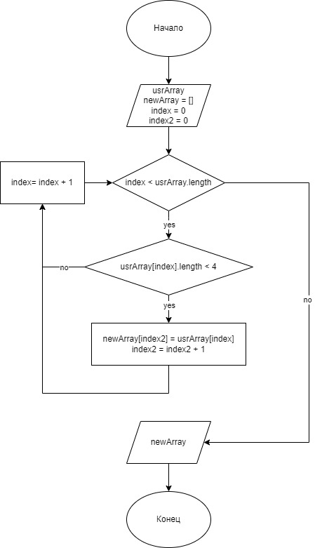

# Инструкция к предлагаемому решению

## Создание репозитория на Github
### Это можно сделать через git bash, но я создаю локальный репозиторий и репозиторий github через Visual Studio IDE

## Решаемая задача:
### Написать программу, которая из имеющегося массива строк формирует массив из строк, длина которых меньше либо равна 3 символа. Первоначальный массив можно ввести с клавиатуры, либо задать на старте выполнения алгоритма. При решении не рекомендуется пользоваться коллекциями, лучше обойтись исключительно массивами.

## Блок схема решения задачи

## Снабдить репозиторий оформленным текстовым описанием решения (это и есть файл)

## Использовать контроль версий. В моем случае, встроенный в visual studio.